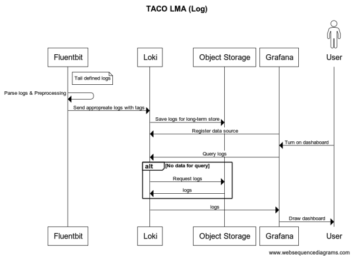
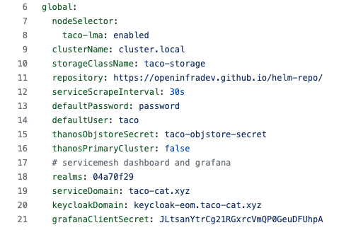
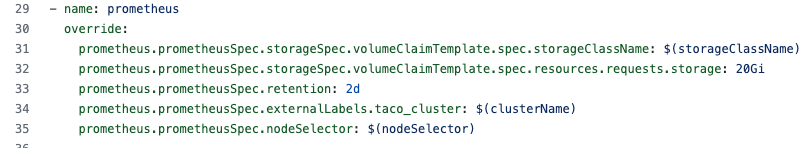
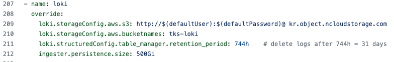
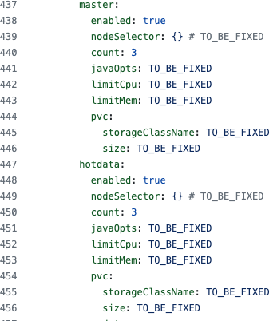
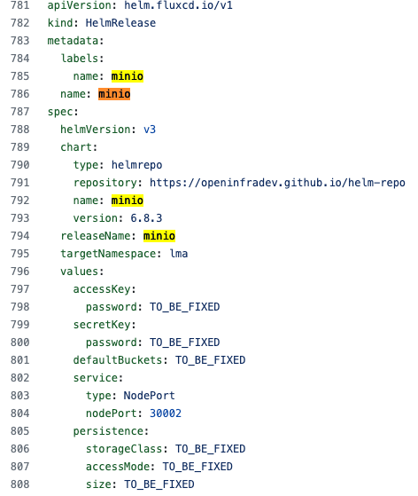
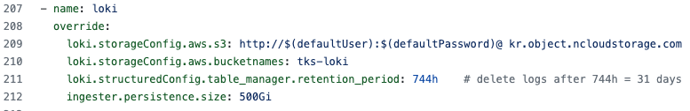
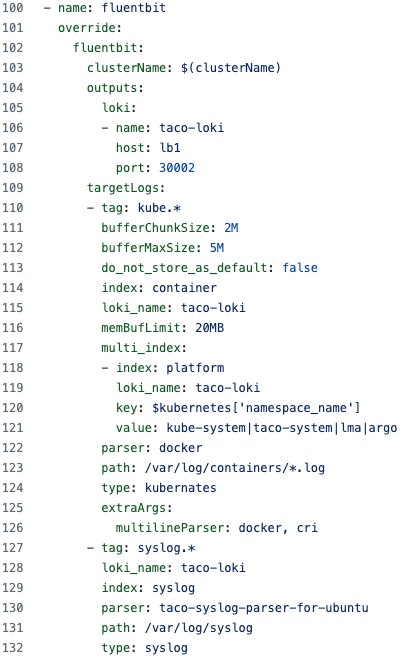
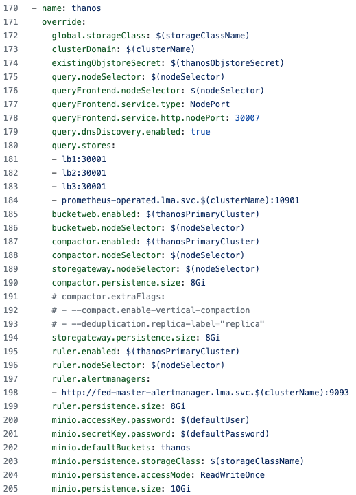
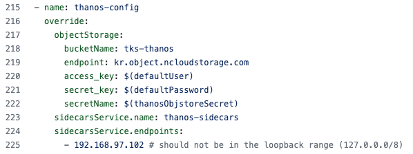

# 2022 교육

feat. ibk, cloit

# LMA

[https://github.com/openinfradev/decapod-base-yaml/blob/doc/lma/base/site-values.yaml](https://github.com/openinfradev/decapod-base-yaml/blob/doc/lma/base/site-values.yaml)

## [LMA 구조](https://tde.sktelecom.com/wiki/pages/viewpage.action?pageId=364552352)

[**LMA 구조**](https://www.notion.so/LMA-3dd2df15fee241b8a08c788d99028bf8)

- Log, Metric, Alert의 3가지가 파이프라인구성됨
- Log 수집&활용 파이프라인
    - Fluentbit
    - Loki
    - Grafana
- Metric 수집&활용 파이프라인
    - Prometheus Exporter
    - Prometheus
    - Thanos
    - Grafana
- Alert발생 및 활용
    - Metric기반 알람: Prometheus의 룰엔진을 통해 서비스됨
    - (TBD) Log기반 알람: Fluentbit에서 정규식방식으로 처리가능하지만 현재 Experimental이고 ibk 적용범위 아님
    - prometheus alertmanager: slack, e-mail, web hook

### 로그시각화




### 매트릭 시각화


## MultiCluster 지원

- Thanos & Loki를 활용
- Object store에 저장된 장기데이터와 Prometheus 혹은 Ingester(loki)에 저장된 데이터를 활용
- 저장구조와 질의 구조가 비대칭
- 중앙 클러스터에 구성(admin cluster)
- Thanos(admin)에 연결할 Prometheus(user) 정보를 명시적으로 기록
- Loki의 정보(admin)를 Fluentbit(user)에 등록하여 로그를 전달할 수 있도록 해야함

## 설정방법

[https://github.com/openinfradev/decapod-base-yaml/blob/main/lma/base/resources.yaml](https://github.com/openinfradev/decapod-base-yaml/blob/main/lma/base/resources.yaml)

[https://github.com/openinfradev/decapod-site/blob/ibk_pre_install/aws-msa-reference/lma/site-values.yaml](https://github.com/openinfradev/decapod-site/blob/ibk_pre_install/aws-msa-reference/lma/site-values.yaml)

### Globals

설정파일 내부적으로 사용할 값들에 대한 정의 (한꺼번에 치환의 역할)

- nodeSelector: pod를 띄울 위치
- clusterName: 해당 클러스터의 이름을 규정 **(멀티클러스터에서 매우 중요하다.)**
- storageClassName: pvc를 만들 sc지정
- repository: airgap 설치를 위한 장치, 한꺼번에 helm repo 치환
- serviceScrapeInterval: metric 수집주기
- defaultUser/defaultPassword: 내부에서 사용할 기본계정지정
- Thanos관련 설정: 수정불가, 외부 Thanos 연동시 사용
- 포탈연동을 위한 설정

site-values.yaml 파일 내부에서 ${변수명}의  형태로 활용된다.



### 저장소 및 저장주기

저장소를 설정하는 컴포넌트

- Prometheus
- Loki
- ElasticSearch
- Minio
- 그외에 설정하는 모듈들이 있으나 캐시나 버퍼용도로 사용하는 것으로 수~수십GB 할당하며 이에 대한 제거시 Pod 재시작을 대비할수 없음

설정하는 방법

- Prometheus

    

- Loki:

    


- ElasiticSearch:
    - [https://github.com/openinfradev/decapod-base-yaml/blob/eeee3d3098bfe50c9ba6971627789f30422e2da6/lma/base/resources.yaml#L436](https://github.com/openinfradev/decapod-base-yaml/blob/eeee3d3098bfe50c9ba6971627789f30422e2da6/lma/base/resources.yaml#L436)



- Minio



### [Alarm](https://tde.sktelecom.com/wiki/pages/viewpage.action?pageId=369048980)

tks에서 제공하는 기본알람은 lma-addons 챠트를 통해 배포가능: “prometheusRules.alert.enabled: true”

설정방법 상세

[https://github.com/openinfradev/helm-charts/tree/main/lma-addons/templates/prometheus-rule](https://github.com/openinfradev/helm-charts/tree/main/lma-addons/templates/prometheus-rule)

[https://github.com/openinfradev/helm-charts/blob/main/lma-addons/templates/prometheus-rule/basic-linux.yaml](https://github.com/openinfradev/helm-charts/blob/main/lma-addons/templates/prometheus-rule/basic-linux.yaml)

- alert: 알럿 명
- expr: PromQL을 통한 조건식
- for: 해당 시간동안 지속발생시 알람
- labels: 알람의 중요도 라벨링
    - severity: page / critical / warning / info
- annotations: 알람 메시지 정의
    - message, summary
    - metric의 demension값을 기반으로 메시지 조립

```yaml
- alert: node_filesystem_full_80percent
  expr: sort(node_filesystem_free_bytes{fstype =~ "xfs|ext[34]"} < node_filesystem_size_bytes{fstype =~ "xfs|ext[34]"} * 0.2) / 1024 ^ 3
  for: 5m
  labels:
    severity: page
  annotations:
    message: '{{`{{ $labels.instance }}`}} device {{`{{ $labels.device }}`}} on {{`{{ $labels.mountpoint }}`}} got less than 10% space left on its filesystem.'
    summary: '{{`{{ $labels.instance }}`}}: Filesystem is running out of space soon.'
```

### [~~Elasticsearch 구성~~](https://tde.sktelecom.com/wiki/pages/viewpage.action?pageId=369048985)

### [Fluentbit 구성](https://tde.sktelecom.com/wiki/pages/viewpage.action?pageId=369048991)

### ~~Kibana 초기화 - 인덱스~~

### Loki 구성




fluentbit에서 연동부분

- loki정의
- targetLogs에서 로그흐름 정의



### Thanos 구성




object store 연동부분



## 기타컴포넌트

### Prometheus exporter들

- kube-state-metrics
- prometheus-node-exporter
- prometheus-process-exporter
- kubernetes-event-exporter

### Addons

- Grafana 초기화 및 대시보드설정
    - 최종적으로는 Configmap구성이되서 추후 추가한 내역에 대해서는 grafana pod 재시작 시에 사라짐
- ServiceMonitor 추가

### Minio

- Thanos와 Loki의 backend

## 참고

- [Grafana Loki에 대해 알아보자](https://devocean.sk.com/experts/techBoardDetail.do?ID=163964)
- [로그수집기 fluentbit in TACO](https://devocean.sk.com/experts/techBoardDetail.do?ID=164148)
- [crossplane으로 S3를 배포하고 Thanos에서 사용하기](https://devocean.sk.com/blog/techBoardDetail.do?ID=163508)
- [Prometheus를 사용한 kubernetes 모니터링](https://devocean.sk.com/blog/techBoardDetail.do?ID=163447)
- [Thanos를 이용한 멀티클러스터 모니터링](https://devocean.sk.com/blog/techBoardDetail.do?ID=163458&)
- [TACO Logging](https://openinfradev.github.io/TACOLogging/)